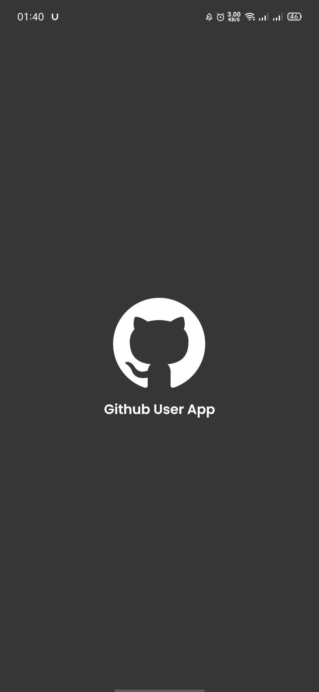
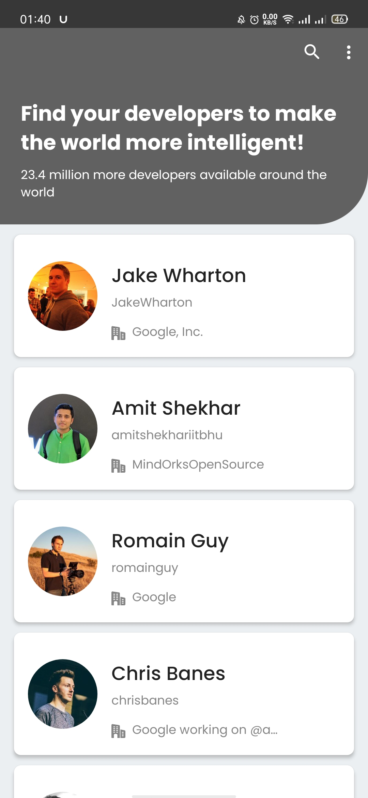
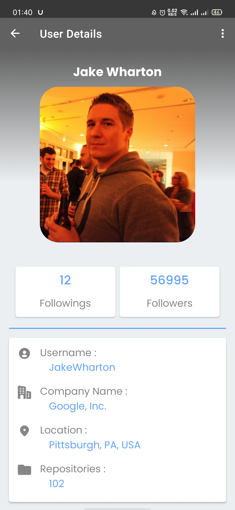

# Dicoding Submission: Belajar Fundamental Aplikasi Android (Submission 1)

This project built for submission 1 of Dicoding Academy's course, titled as **Learning Android Fundamental**
This project **gets 5 start** 🎉🎉

## Features

- Navigation Component
- View Binding
- Custom ShapeableImageView
- List Github Users (still using dummy data)
- Filtering list with feedback status message and loading UI
- Detail From Gighub User List

## Demo

<h3 align="center">
  Splash Screen
</h3>
<p align="center">
    
</p>

<h3 align="center">
  Home
</h3>
<p align="center">
    
</p>

<h3 align="center">
  User Detail
</h3>
<p align="center">
    
</p>


## Author

**Rully Ihza Mahendra** - Reach me on LinkedIn [here](https://www.linkedin.com/in/rully-ihza-mahendra-275a591a5/) </br>
**My Personal Web** - [https://rllyhz.github.io](https://rllyhz.github.io) </br>
**My Email** - [rullyihza00@gmail.com](rullyihza00@gmail.com) </br>


## You can support me

> Just **star** or  **fork** this repository, and follow my github. You have *supported* me!

## LICENSE

```
Copyright 2021 Rully Ihza Mahendra

Licensed under the Apache License, Version 2.0 (the "License");
you may not use this file except in compliance with the License.
You may obtain a copy of the License at

    http://www.apache.org/licenses/LICENSE-2.0

Unless required by applicable law or agreed to in writing, software
distributed under the License is distributed on an "AS IS" BASIS,
WITHOUT WARRANTIES OR CONDITIONS OF ANY KIND, either express or implied.
See the License for the specific language governing permissions and
limitations under the License.
```